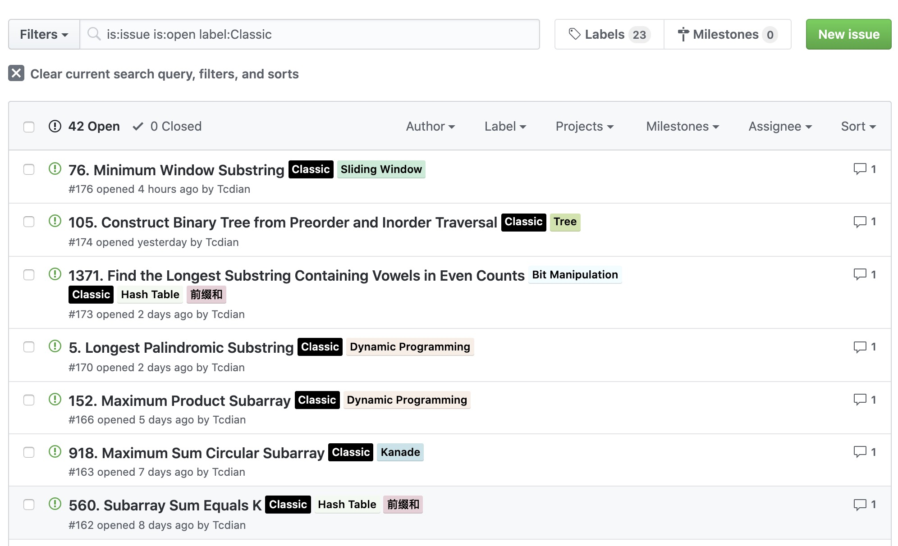

# LeetCode

最近在进行 LeetCode 和力扣中国的每日一题，如果有共同刷题的小伙伴可以点击 [**这里**](https://github.com/Tcdian/keep/issues) 一起参与。

我对题目进行了标签分类，你也可以按 [**标签分类**](https://github.com/Tcdian/keep/labels) 进行刷题。

#

#### 数组 ( Array )

-   [169. Majority Element](./LeetCode_Awake/Array/169.Majority_Element.md)
-   [238. Product of Array Except Self](./LeetCode_Awake/Array/238.Product_of_Array_Except_Self.md)
-   [945. Minimum Increment to Make Array Unique](./LeetCode_Awake/Array/945.Minimum_Increment_to_Make_Array_Unique.md)

#### 链表 ( Linked List )

-   [21. Merge Two Sorted Lists](./LeetCode_Awake/Linked_List/21.Merge_Two_Sorted_Lists.md)
-   [206. Reverse Linked List](./LeetCode_Awake/Linked_List/206.Reverse_Linked_List.md)
-   [143. Reorder List](./LeetCode_Awake/Linked_List/143.Reorder_List.md)

#### 栈 ( Stack )

-   [20. Valid Parentheses](./LeetCode_Awake/Stack/20.Valid_Parentheses.md)
-   [739. Daily Temperatures](./LeetCode_Awake/Stack/739.Daily_Temperatures.md)
-   [581. Shortest Unsorted Continuous Subarray](./LeetCode_Awake/Stack/581.Shortest_Unsorted_Continuous_Subarray.md)
-   [84. Largest Rectangle in Histogram](./LeetCode_Awake/Stack/84.Largest_Rectangle_in_Histogram.md)

#### 树 ( Tree )

-   [543. Diameter of Binary Tree](./LeetCode_Awake/Tree/543.Diameter_of_Binary_Tree.md)
-   [572. Subtree of Another Tree](./LeetCode_Awake/Tree/572.Subtree_of_Another_Tree.md)
-   [101. Symmetric Tree](./LeetCode_Awake/Tree/101.Symmetric_Tree.md)
-   [105. Construct Binary Tree from Preorder and Inorder Traversal](./LeetCode_Awake/Tree/105.Construct_Binary_Tree_from_Preorder_and_Inorder_Traversal.md)
-   [114. Flatten Binary Tree to Linked List](./LeetCode_Awake/Tree/114.Flatten_Binary_Tree_to_Linked_List.md)
-   [222. Count Complete Tree Nodes](./LeetCode_Awake/Tree/222.Count_Complete_Tree_Nodes.md)

#### 二叉搜索树 ( BST )

-   [530. Minimum Absolute Difference in BST](./LeetCode_Awake/BST/530.Minimum_Absolute_Difference_in_BST.md)

#### 字典树（前缀树） ( Trie )

-   [208. Implement Trie (Prefix Tree)](./LeetCode_Awake/Trie/208.Implement_Trie.md)
-   [212. Word Search II](./LeetCode_Awake/Trie/212.Word_Search_II.md)

#### 哈希表 ( Hash Table )

-   [128. Longest Consecutive Sequence](./LeetCode_Awake/Hash_Table/128.Longest_Consecutive_Sequence.md)

#### 堆 ( Heap )

-   [23. Merge k Sorted Lists](./LeetCode_Awake/Heap/23.Merge_k_Sorted_Lists.md)

#### 图 ( Graph )

-   [126. Word Ladder II](./LeetCode_Awake/Graph/126.Word_Ladder_II.md)

#### 二分查找 ( Binary Search )

-   [35. Search Insert Position](./LeetCode_Awake/Binary_Search/35.Search_Insert_Position.md)
-   [154. Find Minimum in Rotated Sorted Array II](./LeetCode_Awake/Binary_Search/154.Find_Minimum_in_Rotated_Sorted_Array_II.md)
-   [33. Search in Rotated Sorted Array](./LeetCode_Awake/Binary_Search/33.Search_in_Rotated_Sorted_Array.md)
-   [378. Kth Smallest Element in a Sorted Matrix](./LeetCode_Awake/Binary_Search/378.Kth_Smallest_Element_in_a_Sorted_Matrix.md)
-   [4. Median of Two Sorted Arrays](./LeetCode_Awake/Binary_Search/4.Median_of_Two_Sorted_Arrays.md)

#### 位运算 ( Bit Manipulation )

-   [338. Counting Bits](./LeetCode_Awake/Bit_Manipulation/338.Counting_Bits.md)

#### 分治算法 ( Divide And Conquer )

-   [95. Unique Binary Search Trees II](./LeetCode_Awake/Divide_And_Conquer/95.Unique_Binary_Search_Trees_II.md)
-   [315. Count of Smaller Numbers After Self](./LeetCode_Awake/Divide_And_Conquer/315.Count_of_Smaller_Numbers_After_Self.md)
-   [215. Kth Largest Element in an Array](./LeetCode_Awake/Divide_And_Conquer/215.Kth_Largest_Element_in_an_Array.md)

#### 排序 ( Sort )

-   [912. Sort an Array](./LeetCode_Awake/sort/912.Sort_an_Array.md)

#### 回溯算法 ( Backtracking )

-   [78. Subsets](./LeetCode_Awake/Backtracking/78.Subsets.md)
-   [22. Generate Parentheses](./LeetCode_Awake/Backtracking/22.Generate_Parentheses.md)
-   [79. Word Search](./LeetCode_Awake/Backtracking/79.Word_Search.md)
-   [140. Word Break II](./LeetCode_Awake/Backtracking/140.Word_Break_II.md)

#### 双指针 ( Two Pointers )

-   [75. Sort Colors](./LeetCode_Awake/Two_Pointers/75.Sort_Colors.md)
-   [209. Minimum Size Subarray Sum](./LeetCode_Awake/Two_Pointers/209.Minimum_Size_Subarray_Sum.md)
-   [15. 3Sum](./LeetCode_Awake/Two_Pointers/15.3Sum.md)
-   [11. Container With Most Water](./LeetCode_Awake/Two_Pointers/11.Container_With_Most_Water.md)
-   [42. Trapping Rain Water](./LeetCode_Awake/Two_Pointers/42.Trapping_Rain_Water.md)

#### 滑动窗口 ( Sliding Window )

-   [3. Longest Substring Without Repeating Characters](./LeetCode_Awake/Sliding_Window/3.Longest_Substring_Without_Repeating_Characters.md)
-   [76. Minimum Window Substring](./LeetCode_Awake/Sliding_Window/76.Minimum_Window_Substring.md)
-   [632. Smallest Range Covering Elements from K Lists](./LeetCode_Awake/Sliding_Window/632.Smallest_Range_Covering_Elements_from_K_Lists.md)

#### 动态规划 ( DP )

-   [70. Climbing Stairs](./LeetCode_Awake/DP/70.Climbing_Stairs.md)
-   [120. Triangle](./LeetCode_Awake/DP/120.Triangle.md)
-   [198. House Robber](./LeetCode_Awake/DP/198.House_Robber.md)
-   [152. Maximum Product Subarray](./LeetCode_Awake/DP/152.Maximum_Product_Subarray.md)
-   [322. Coin Change](./LeetCode_Awake/DP/322.Coin_Change.md)
-   [518. Coin Change 2](./LeetCode_Awake/DP/518.Coin_Change_2.md)
-   [309. Best Time to Buy and Sell Stock with Cooldown](./LeetCode_Awake/DP/309.Best_Time_to_Buy_and_Sell_Stock_with_Cooldown.md)
-   [983. Minimum Cost For Tickets](./LeetCode_Awake/DP/983.Minimum_Cost_For_Tickets.md)
-   [221. Maximal Square](./LeetCode_Awake/DP/221.Maximal_Square.md)
-   [279. Perfect Squares](./LeetCode_Awake/dp/279.Perfect_Squares.md)
-   [300. Longest Increasing Subsequence](./LeetCode_Awake/DP/300.Longest_Increasing_Subsequence.md)
-   [718. Maximum Length of Repeated Subarray](./LeetCode_Awake/DP/718.Maximum_Length_of_Repeated_Subarray.md)
-   [5. Longest Palindromic Substring](./LeetCode_Awake/DP/5.Longest_Palindromic_Substring.md)
-   [139. Word Break](./LeetCode_Awake/DP/139.Word_Break.md)
-   [97. Interleaving String](./LeetCode_Awake/DP/97.Interleaving_String.md)
-   [72. Edit Distance](./LeetCode_Awake/DP/72.Edit_Distance.md)
-   [10. Regular Expression Matching](./LeetCode_Awake/DP/10.Regular_Expression_Matching.md)
-   [174. Dungeon Game](./LeetCode_Awake/DP/174.Dungeon_Game.md)
-   [312. Burst Balloons](./LeetCode_Awake/DP/312.Burst_Balloons.md)
-   [887. Super Egg Drop](./LeetCode_Awake/DP/887.Super_Egg_Drop.md)

#### Kanade ( Kanade )

-   [53. Maximum Subarray](./LeetCode_Awake/Kanade/53.Maximum_Subarray.md)
-   [918. Maximum Sum Circular Subarray](./LeetCode_Awake/Kanade/918.Maximum_Sum_Circular_Subarray.md)

#### 前缀和 ( Prefix Sum )

-   [560. Subarray Sum Equals K](./LeetCode_Awake/Prefix_Sum/560.Subarray_Sum_Equals_K.md)
-   [1248. Count Number of Nice Subarrays](./LeetCode_Awake/Prefix_Sum/1248.Count_Number_of_Nice_Subarrays.md)
-   [1371. Find the Longest Substring Containing Vowels in Even Counts](./LeetCode_Awake/Prefix_Sum/1371.Find_the_Longest_Substring_Containing_Vowels_in_Even_Counts.md)

#### 贪心算法 ( Greedy )

-   [55. Jump Game](./LeetCode_Awake/Greedy/55.Jump_Game.md)
-   [45. Jump Game II](./LeetCode_Awake/Greedy/45.Jump_Game_II.md)

#### 深度优先搜索 ( DFS )

-   [200. Number of Islands](./LeetCode_Awake/DFS/200.Number_of_Islands.md)
-   [337. House Robber III](./LeetCode_Awake/DFS/337.House_Robber_III.md)
-   [124. Binary Tree Maximum Path Sum](./LeetCode_Awake/DFS/124.Binary_Tree_Maximum_Path_Sum.md)
-   [437. Path Sum III](./LeetCode_Awake/DFS/437.Path_Sum_III.md)

#### 广度优先搜索 ( BFS )

-   [994. Rotting Oranges](./LeetCode_Awake/BFS/994.Rotting_Oranges.md)
-   [542. 01 Matrix](./LeetCode_Awake/BFS/542.01_Matrix.md)
-   [199. Binary Tree Right Side View](./LeetCode_Awake/BFS/199.Binary_Tree_Right_Side_View.md)

#### 拓扑排序 ( Topological Sort )

-   [207. Course Schedule](./LeetCode_Awake/Topological_Sort/207.Course_Schedule.md)
-   [210. Course Schedule II](./LeetCode_Awake/Topological_Sort/210.Course_Schedule_II.md)

#### Rabin Karp ( Rabin Karp )

-   [1044. Longest Duplicate Substring](./LeetCode_Awake/RabinKarp/1044.Longest_Duplicate_Substring.md)

#### 设计 ( Design )

-   [155. Min Stack](./LeetCode_Awake/Design/155.Min_Stack.md)
-   [《剑指 Offer（第 2 版）》59 - II. 队列的最大值](./LeetCode_Awake/Design/59-II.队列的最大值.md)
-   [380. Insert Delete GetRandom O(1)](<./LeetCode_Awake/Design/380.Insert_Delete_GetRandom_O(1).md>)
-   [146. LRU Cache](./LeetCode_Awake/Design/146.LRU_Cache.md)
-   [460. LFU Cache](./LeetCode_Awake/Design/460.LFU_Cache.md)

## 下面是之前整理的目录，我目前正在进行重新整理，主要是题目标签的细化，所以前面的题目可能偏少，后面会慢慢把题目整合，工作原因可能比较慢，欢迎大家一起来参与 [每日一题](https://github.com/Tcdian/keep/issues)。

#### 链表

-   [92. Reverse Linked List II](./LeetCode/LinkedList/92.ReverseLinkedListII.js)
-   [160. Intersection of Two Linked Lists](./LeetCode/LinkedList/160.IntersectionofTwoLinkedLists.js)
-   [142. Linked List Cycle II](./LeetCode/LinkedList/142.LinkedListCycleII.js)
-   [86. Partition List](./LeetCode/LinkedList/86.PartitionList.js)
-   [138. Copy List with Random Pointer](./LeetCode/LinkedList/138.CopyListWithRandomPointer.js)

#### 栈 队列 堆

-   [225. Implement Stack using Queues](./LeetCode/Stack&Queue&Heap/225.ImplementStackUsingQueues.js)
-   [232. Implement Queue using Stacks](./LeetCode/Stack&Queue&Heap/232.ImplementQueueUsingStacks.js)
-   [224. Basic Calculator](./LeetCode/Stack&Queue&Heap/224.BasicCalculator.js)
-   [239. Sliding Window Maximum](./LeetCode/Stack&Queue&Heap/239.SlidingWindowMaximum.js)
-   [295. Find Median from Data Stream](./LeetCode/Stack&Queue&Heap/295.FindMedianFromDataStream.js)

#### 贪心算法

-   [455. Assign Cookies](./LeetCode/Greedy/455.AssignCookies.js)
-   [376. Wiggle Subsequence](./LeetCode/Greedy/376.WiggleSubsequence.js)
-   [402. Remove K Digits](./LeetCode/Greedy/402.RemoveKDigits.js)
-   [452. Minimum Number of Arrows to Burst Balloons](./LeetCode/Greedy/452.MinimumNumberOfArrowsToBurstBalloons.js)

#### 递归与回溯

-   [90. Subsets II](./LeetCode/Recursion&Backtracking/90.SubsetsII.js)
-   [40. Combination Sum II](./LeetCode/Recursion&Backtracking/40.CombinationSumII.js)
-   [51. N-Queens](./LeetCode/Recursion&Backtracking/51.N-Queens.js)
-   [473. Matchsticks to Square](./LeetCode/Recursion&Backtracking/473.MatchsticksToSquare.js)

#### 二分查找与分治算法

-   [34. Find First and Last Position of Element in Sorted Array](./LeetCode/BinarySearch&DivideAndConquer/34.FindFirstAndLastPositionOfElementInSortedArray.js)

#### 二叉树

-   [113. Path Sum II](./LeetCode/Tree/113.PathSumII.js)
-   [236. Lowest Common Ancestor of a Binary Tree](./LeetCode/Tree/236.LowestCommonAncestorOfABinaryTree.js)
-   [144. Binary Tree Preorder Traversal](./LeetCode/Tree/144.BinaryTreePreorderTraversal.js)
-   [94. Binary Tree Inorder Traversal](./LeetCode/Tree/94.BinaryTreeInorderTraversal.js)
-   [145. Binary Tree Postorder Traversal](./LeetCode/Tree/145.BinaryTreePostorderTraversal.js)
-   [687. Longest Univalue Path](./LeetCode/Tree/687.LongestUnivaluePath.js)
-   [297. Serialize and Deserialize Binary Tree](./LeetCode/Tree/297.SerializeAndDeserializeBinaryTree.js)

#### 哈希表和字符串

-   [1. Two Sum](./LeetCode/Hash&String/1.TwoSum.js)
-   [409. Longest Palindrome](./LeetCode/Hash&String/409.LongestPalindrome.js)
-   [290. Word Pattern](./LeetCode/Hash&String/290.WordPattern.js)
-   [49. Group Anagrams](./LeetCode/Hash&String/49.GroupAnagrams.js)

#### Two Pointers

-   [283. Move Zeroes](./LeetCode/TwoPointers/283.MoveZeroes.js)

#### 动态规划

-   [213. House Robber II](./LeetCode/DP/213.HouseRobberII.js)
-   [714. Best Time to Buy and Sell Stock with Transaction Fee](./LeetCode/DP/714.BestTimeToBuyAndSellStockWithTransactionFee.js)
-   [486. Predict the Winner](./LeetCode/DP/486.PredictTheWinner.js)
-   [64. Minimum Path Sum](./LeetCode/DP/64.MinimumPathSum.js)
-   [96. Unique Binary Search Trees](./LeetCode/DP/96.UniqueBinarySearchTrees.js)
-   [329. Longest Increasing Path in a Matrix](./LeetCode/DP/329.LongestIncreasingPathInAMatrix.js)

#### 二叉搜索树

-   [108. Convert Sorted Array to Binary Search Tree](./LeetCode/BST/108.ConvertSortedArrayToBinarySearchTree.js)
-   [450. Delete Node in a BST](./LeetCode/BST/450.DeleteNodeInABST.js)
-   [538. Convert BST to Greater Tree](./LeetCode/BST/538.ConvertBSTToGreaterTree.js)
-   [449. Serialize and Deserialize BST](./LeetCode/BST/449.SerializeAndDeserializeBST.js)

#### 线段树

-   [307. Range Sum Query - Mutable](./LeetCode/SegementTree/307.RangeSumQuery-Mutable.js)

#### Trie 树

-   [677. Map Sum Pairs](./LeetCode/Trie/677.MapSumPairs.js)

#### 并查集

-   [547. Friend Circles](./LeetCode/UnionFind/547.FriendCircles.js)

#### 深度优先搜索

-   [337. House Robber III](./LeetCode/DFS/337.HouseRobberIII.js)

#### 广度优先搜索

-   [102. Binary Tree Level Order Traversal](./LeetCode/BFS/102.BinaryTreeLevelOrderTraversal.js)
-   [127. Word Ladder](./LeetCode/BFS/127.WordLadder.js)
-   [407. Trapping Rain Water II](./LeetCode/BFS/407.TrappingRainWaterII.js)

#### Design

-   [381. Insert Delete GetRandom O(1) - Duplicates allowed](<./LeetCode/Design/381.InsertDeleteGetRandomO(1)-DuplicatesAllowed.js>)
