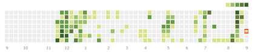

# LeetCode

LeetCode 经典题目汇总 ( javascript实现 )

刷LeetCode有一段时间了,下面记录一些经典的题目, 用来以后复习回顾使用.

### LeetCode: [https://leetcode.com/tcdian/](https://leetcode.com/tcdian/)

### 常用数据结构实现

- [栈 Stack](./DataStructure/Stack.js)
- [队列 Queue](./DataStructure/Queue.js)
- [二叉搜索树 BST](./DataStructure/BST.js)
- [优先队列 Priority Queue](./DataStructure/PriorityQueue.js)
- [线段树 Segment Tree](./DataStructure/SegmentTree.js)
- [前缀树 Trie](./DataStructure/Trie.js)
- [并查集 UnionFind](./DataStructure/UnionFind.js)
- [AVL 树](./DataStructure/AVL.js)
- [红黑树 Red-black Tree](./DataStructure/RBTree.js)

### LeetCode题目

#### 链表
- [206. Reverse Linked List](./LeetCode/LinkedList/206.ReverseLinkedList.js)
- [92.  Reverse Linked List II](./LeetCode/LinkedList/92.ReverseLinkedListII.js)
- [21.  Merge Two Sorted Lists](./LeetCode/LinkedList/21.MergeTwoSortedLists.js)
- [160. Intersection of Two Linked Lists](./LeetCode/LinkedList/160.IntersectionofTwoLinkedLists.js)
- [142. Linked List Cycle II](./LeetCode/LinkedList/142.LinkedListCycleII.js)
- [86.  Partition List](./LeetCode/LinkedList/86.PartitionList.js)
- [138. Copy List with Random Pointer](./LeetCode/LinkedList/138.CopyListWithRandomPointer.js)

#### 栈 队列 堆
- [20. Valid Parentheses](./LeetCode/Stack&Queue&Heap/20.ValidParentheses.js)
- [225. Implement Stack using Queues](./LeetCode/Stack&Queue&Heap/225.ImplementStackUsingQueues.js)
- [232. Implement Queue using Stacks](./LeetCode/Stack&Queue&Heap/232.ImplementQueueUsingStacks.js)
- [155. Min Stack](./LeetCode/Stack&Queue&Heap/155.MinStack.js)
- [224. Basic Calculator](./LeetCode/Stack&Queue&Heap/224.BasicCalculator.js)
- [239. Sliding Window Maximum](./LeetCode/Stack&Queue&Heap/239.SlidingWindowMaximum.js)
- [300. Longest Increasing Subsequence](./LeetCode/DP/300.LongestIncreasingSubsequence.js)
- [215. Kth Largest Element in an Array](./LeetCode/Stack&Queue&Heap/215.KthLargestElementInAnArray.js)
- [295. Find Median from Data Stream](./LeetCode/Stack&Queue&Heap/295.FindMedianFromDataStream.js)

#### 贪心算法
- [455. Assign Cookies](./LeetCode/Greedy/455.AssignCookies.js)
- [376. Wiggle Subsequence](./LeetCode/Greedy/376.WiggleSubsequence.js)
- [402. Remove K Digits](./LeetCode/Greedy/402.RemoveKDigits.js)
- [55. Jump Game](./LeetCode/Greedy/55.JumpGame.js)
- [45. Jump Game II](./LeetCode/Greedy/45.JumpGameII.js)
- [452. Minimum Number of Arrows to Burst Balloons](./LeetCode/Greedy/452.MinimumNumberOfArrowsToBurstBalloons.js)

#### 递归与回溯
- [78. Subsets](./LeetCode/Recursion&Backtracking/78.Subsets.js)
- [90. Subsets II](./LeetCode/Recursion&Backtracking/90.SubsetsII.js)
- [40. Combination Sum II](./LeetCode/Recursion&Backtracking/40.CombinationSumII.js)
- [22. Generate Parentheses](./LeetCode/Recursion&Backtracking/22.GenerateParentheses.js)
- [51. N-Queens](./LeetCode/Recursion&Backtracking/51.N-Queens.js)
- [473. Matchsticks to Square](./LeetCode/Recursion&Backtracking/473.MatchsticksToSquare.js)

#### 二分查找与分治算法
- [35. Search Insert Position](./LeetCode/BinarySearch&DivideAndConquer/35.SearchInsertPosition.js)
- [34. Find First and Last Position of Element in Sorted Array](./LeetCode/BinarySearch&DivideAndConquer/34.FindFirstAndLastPositionOfElementInSortedArray.js)
- [33. Search in Rotated Sorted Array](./LeetCode/BinarySearch&DivideAndConquer/33.SearchInRotatedSortedArray.js)
- [315. Count of Smaller Numbers After Self](./LeetCode/BinarySearch&DivideAndConquer/315.CountOfSmallerNumbersAfterSelf.js)
- [23. Merge k Sorted Lists](./LeetCode/BinarySearch&DivideAndConquer/23.MergeKSortedLists.js)

#### 二叉树
- [101. Symmetric Tree](./LeetCode/Tree/101.SymmetricTree.js)
- [113. Path Sum II](./LeetCode/Tree/113.PathSumII.js)
- [236. Lowest Common Ancestor of a Binary Tree](./LeetCode/Tree/236.LowestCommonAncestorOfABinaryTree.js)
- [114. Flatten Binary Tree to Linked List](./LeetCode/Tree/114.FlattenBinaryTreeToLinkedList.js)
- [199. Binary Tree Right Side View](./LeetCode/Tree/199.BinaryTreeRightSideView.js)
- [144. Binary Tree Preorder Traversal](./LeetCode/Tree/144.BinaryTreePreorderTraversal.js)
- [94. Binary Tree Inorder Traversal](./LeetCode/Tree/94.BinaryTreeInorderTraversal.js)
- [145. Binary Tree Postorder Traversal](./LeetCode/Tree/145.BinaryTreePostorderTraversal.js)
- [687. Longest Univalue Path](./LeetCode/Tree/687.LongestUnivaluePath.js)
- [297. Serialize and Deserialize Binary Tree](./LeetCode/Tree/297.SerializeAndDeserializeBinaryTree.js)

#### 哈希表和字符串
- [1. Two Sum](./LeetCode/Hash&String/1.TwoSum.js)
- [409. Longest Palindrome](./LeetCode/Hash&String/409.LongestPalindrome.js)
- [290. Word Pattern](./LeetCode/Hash&String/290.WordPattern.js)
- [49. Group Anagrams](./LeetCode/Hash&String/49.GroupAnagrams.js)
- [3. Longest Substring Without Repeating Characters](./LeetCode/Hash&String/3.LongestSubstringWithoutRepeatingCharacters.js)
- [76. Minimum Window Substring](./LeetCode/Hash&String/76.MinimumWindowSubstring.js)
- [128. Longest Consecutive Sequence](./LeetCode/Hash&String/128.LongestConsecutiveSequence.js)

#### Two Pointers
- [283. Move Zeroes](./LeetCode/TwoPointers/283.MoveZeroes.js)
- [75. Sort Colors](./LeetCode/TwoPointers/75.SortColors.js)
- [209. Minimum Size Subarray Sum](./LeetCode/TwoPointers/209.MinimumSizeSubarraySum.js)
- [76. Minimum Window Substring](./LeetCode/TwoPointers/76.MinimumWindowSubstring.js)
- [15. 3Sum](./LeetCode/TwoPointers/15.3Sum.js)
- [3. Longest Substring Without Repeating Characters](./LeetCode/TwoPointers/3.LongestSubstringWithoutRepeatingCharacters.js)
- [11. Container With Most Water](./LeetCode/TwoPointers/11.ContainerWithMostWater.js)
- [42. Trapping Rain Water](./LeetCode/TwoPointers/42.TrappingRainWater.js)

#### 动态规划
- [70. Climbing Stairs](./LeetCode/DP/70.ClimbingStairs.js)
- [198. House Robber](./LeetCode/DP/198.HouseRobber.js)
- [213. House Robber II](./LeetCode/DP/213.HouseRobberII.js)
- [309. Best Time to Buy and Sell Stock with Cooldown](./LeetCode/DP/309.BestTimeToBuyAndSellStockWithCooldown.js)
- [714. Best Time to Buy and Sell Stock with Transaction Fee](./LeetCode/DP/714.BestTimeToBuyAndSellStockWithTransactionFee.js)
- [486. Predict the Winner](./LeetCode/DP/486.PredictTheWinner.js)
- [53. Maximum Subarray](./LeetCode/DP/53.MaximumSubarray.js)
- [322. Coin Change](./LeetCode/DP/322.CoinChange.js)
- [120. Triangle](./LeetCode/DP/120.Triangle.js)
- [139. Word Break](./LeetCode/DP/139.WordBreak.js)
- [300. Longest Increasing Subsequence](./LeetCode/DP/300.LongestIncreasingSubsequence.js)
- [5. Longest Palindromic Substring](./LeetCode/DP/5.LongestPalindromicSubstring.js)
- [718. Maximum Length of Repeated Subarray](./LeetCode/DP/718.MaximumLengthOfRepeatedSubarray.js)
- [64. Minimum Path Sum](./LeetCode/DP/64.MinimumPathSum.js)
- [174. Dungeon Game](./LeetCode/DP/174.DungeonGame.js)
- [96. Unique Binary Search Trees](./LeetCode/DP/96.UniqueBinarySearchTrees.js)
- [329. Longest Increasing Path in a Matrix](./LeetCode/DP/329.LongestIncreasingPathInAMatrix.js)
- [312. Burst Balloons](./LeetCode/DP/312.BurstBalloons.js)

#### 二叉搜索树
- [108. Convert Sorted Array to Binary Search Tree](./LeetCode/BST/108.ConvertSortedArrayToBinarySearchTree.js)
- [450. Delete Node in a BST](./LeetCode/BST/450.DeleteNodeInABST.js)
- [538. Convert BST to Greater Tree](./LeetCode/BST/538.ConvertBSTToGreaterTree.js)
- [449. Serialize and Deserialize BST](./LeetCode/BST/449.SerializeAndDeserializeBST.js)
- [315. Count of Smaller Numbers After Self](./LeetCode/BinarySearch&DivideAndConquer/315.CountOfSmallerNumbersAfterSelf.js)

#### 线段树
- [307. Range Sum Query - Mutable](./LeetCode/SegementTree/307.RangeSumQuery-Mutable.js)
- [315. Count of Smaller Numbers After Self](./LeetCode/BinarySearch&DivideAndConquer/315.CountOfSmallerNumbersAfterSelf.js)

#### Trie 树
- [208. Implement Trie (Prefix Tree)](./LeetCode/Trie/208.ImplementTrie(PrefixTree).js)
- [211. Add and Search Word - Data structure design](./LeetCode/Trie/211.AddAndSearchWord-DataStructureDesign.js)
- [677. Map Sum Pairs](./LeetCode/Trie/677.MapSumPairs.js)

#### 并查集
- [547. Friend Circles](./LeetCode/UnionFind/547.FriendCircles.js)

#### 深度优先搜索
- [200. Number of Islands](./LeetCode/DFS/200.NumberOfIslands.js)
- [337. House Robber III](./LeetCode/DFS/337.HouseRobberIII.js)
- [124. Binary Tree Maximum Path Sum](./LeetCode/DFS/124.BinaryTreeMaximumPathSum.js)
- [79. Word Search](./LeetCode/DFS/79.WordSearch.js)
- [140. Word Break II](./LeetCode/DFS/140.WordBreakII.js)

#### 广度优先搜索
- [102. Binary Tree Level Order Traversal](./LeetCode/BFS/102.BinaryTreeLevelOrderTraversal.js)
- [200. Number of Islands](./LeetCode/DFS/200.NumberOfIslands.js)
- [127. Word Ladder](./LeetCode/BFS/127.WordLadder.js)
- [126. Word Ladder II](./LeetCode/BFS/126.WordLadderII.js)
- [407. Trapping Rain Water II](./LeetCode/BFS/407.TrappingRainWaterII.js)

#### Design
- [380. Insert Delete GetRandom O(1)](./LeetCode/Design/380.InsertDeleteGetRandomO(1).js)
- [381. Insert Delete GetRandom O(1) - Duplicates allowed](./LeetCode/Design/381.InsertDeleteGetRandomO(1)-DuplicatesAllowed.js)
- [146. LRU Cache](./LeetCode/Design/146.LRUCache.js)

